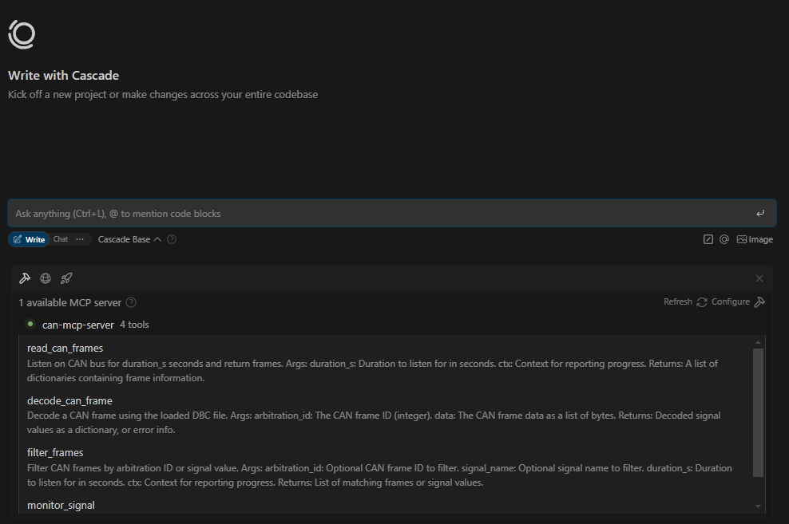

# MCP vCAN Automotive Demo

## Overview

This project demonstrates the **Model Context Protocol (MCP)** in the context of automotive embedded systems. It uses a Raspberry Pi (or any Linux system) and a virtual CAN (vCAN) interface to simulate reading messages, frames, and signals from real Electronic Control Units (ECUs) on a CAN bus. The demo includes:

- **CAN bus simulation** using vCAN and Python.
- **ECU message simulation** with periodic CAN frame transmission.
- **MCP server** for querying CAN frames and DBC (database) information.
- **DBC file** describing the CAN network and signals.

This setup is ideal for learning, prototyping, or testing automotive CAN workflows without real hardware.

## Features

- Simulate multiple ECUs sending CAN frames using [simulate-ecus.py](simulate-ecus.py)
- Query and decode CAN frames and signals via an MCP server ([can-mcp.py](can-mcp.py))
- Use a [vehicle.dbc](vehicle.dbc) file to describe CAN messages and signals
- Docker support for easy setup and reproducibility

## Project Structure

- [`can-mcp.py`](can-mcp.py): FastMCP server for reading and decoding CAN frames, and exposing DBC info.
- [`simulate-ecus.py`](simulate-ecus.py): Simulates ECUs by sending periodic CAN messages on vCAN.
- [`vehicle.dbc`](vehicle.dbc): CAN database file describing messages and signals.
- [`setup-vcan.sh`](setup-vcan.sh): Script to set up the vCAN interface on Linux.
- [`requirements.txt`](requirements.txt): Python dependencies.

## Getting Started

### Prerequisites

- Linux system (for vCAN; Raspberry Pi recommended)
- Python 3.8+
- Docker (optional, for containerized setup)

### 1. Set Up vCAN Interface

On your Linux system, run:

```bash
bash setup-vcan.sh
```

This will create a `vcan0` interface for CAN simulation.

### 2. Install Python Dependencies

```bash
pip install -r requirements.txt
```

### 3. Run the ECU Simulator

Start the ECU simulation (sends CAN frames on `vcan0`):

```bash
python3 simulate-ecus.py
```

### 4. Start the MCP Server

In a separate terminal, run:

```bash
python3 can-mcp.py
```

The server will listen for MCP requests (default port: 6278).

## How It Works

- The simulator sends CAN messages (ENGINE_STATUS, ABS_STATUS, etc.) on the virtual CAN bus.
- The MCP server listens on the same bus, allowing you to query raw frames, decode signals, and inspect the DBC structure.
- All CAN traffic is virtual—no hardware required.

## Adding MCP server to MCP host 
- To add the MCP server to an MCP host, you need to ensure that the MCP server is running and accessible from the host.
- You can do this by specifying the MCP server's IP address and port in the MCP host configuration.
- The MCP host will then be able to send requests to the MCP server and receive responses.

- Example: Adding the MCP server to windsurf:
    - In the windsurf configuration file:
    ```json
    {
        "mcpServers": {
            "can-mcp-server": {
                "serverUrl": "http://<PI's IP>:6278/sse"
            }
        }
    }
    ```


## Example User Prompts

You can interact with the MCP server using natural language prompts. Here are some example prompts you can try:

- **"Show me all CAN frames received in the last 2 seconds."**
- **"List all signals in the ENGINE_STATUS message."**
- **"Monitor the ENGINE_SPEED signal for 3 seconds and show the values."**
- **"Filter and display only frames with arbitration ID 256."**
- **"Give me a summary of the CAN messages and their signals from the DBC file."**
- **"What is the current value of the FUEL_LEVEL signal?"**
- **"Provide a detailed analysis of the last 10 CAN frames."**
- **"Show the decoded values for all signals in the ABS_STATUS message."**
- **"Display the DBC version and all available nodes."**
- **"Summarize the signals and their units for BODY_STATUS."**
- **"List all diagnostic request and response messages."**
- **"Show the meaning of the SYSTEM_STATUS signal values."**
- **"Which messages are sent by the AIRBAG ECU?"**
- **"What are the possible values for the WIPER_STATUS signal?"**

## License

MIT License

---

**Note:** This project is for educational and prototyping purposes only. For real automotive applications, use certified hardware and follow safety standards.